# VQ-VAE HipMRI Image Generation

## Description
Author: Youngsu Choi - 45182822 

This repository implements a **Vector-Quantized Variational Autoencoder 
(VQ-VAE)** to create a generative model of the HipMRI Study on Prostate 
Cancer using processed 2D slice images. Our primary objective is to produce 
reasonably clear images and with the measure of clarity performance 
using Sturctural Similarity Measure (SSIM) and having a SSIM score of at least 0.6. 

Beyond reconstruction, this project explores the Model in further detail by: 
- Visualising the discrete latent space (Index Map visualisation)
- Inspecting the learned **codebook embeddings** space 
- And Monitoring the **codebook usage**

Please refer to the original VQ-VAE paper for more details: https://arxiv.org/abs/1711.00937

---
## Table of Contents
- [Project Structure](#project-structure)
- [Model Architecture](#model-architecture)
  - [AutoEncoders and VAE](#autoencoders-and-vae)
  - [Vector-Quantized VAE](#vector-quantized-vae)
- [Dataset and Preprocessing](#dataset-and-preprocessing)
- [Training Process](#training-process)
  - [First Attempt](#first-attempt)
  - [Adding Residuals](#adding-residuals)
  - [Finetuning & Final Results](#finetuning-and-final-results)
- [Extra Analysis](#extra-analysis)
  - [Latent Index Map](#latent-index-map)
  - [Codebook Usage Visualisation](#codebook-usage-visualisation)
  - [Codebook Visualisation](#codebook-visualisation)
- [Dependencies](#dependencies)
- [Usage](#usage)
- [References](#references)

## Project Structure
There are 5 main files for this project.
```
VQVAE-s4518282/
├─ train.py            # Main script for training the VQ-VAE model.
├─ predict.py          # Script for generating new images from the trained model.
├─ modules.py          # Contains VQ-VAE components (Encoder, Decoder, Quantizer)
├─ dataset.py          # Handles data loading and preprocessing.
├─ config.py           # Contains all configs for train and predictions
├─ checkpoints/        # (Excluded from repo) Should be automatically created when training
└─ hipmri/             # (Excluded from repo) Put your raw dataset here.
```

## Model Architecture

### AutoEncoders and VAE

**Autoencoders** are a simple foundational model that learns a pair of functions: an **encoder** which compresses an input image $x$ into a latent representation $z$, and a **decoder** that reconstructs $\hat{x}$ from $z$. Training typically minimises a pixel-wise loss (e.g. MSE or BCE), encouraging the model to reconstruct $\hat{x}$ that resemble $x$.

<p align="center">
 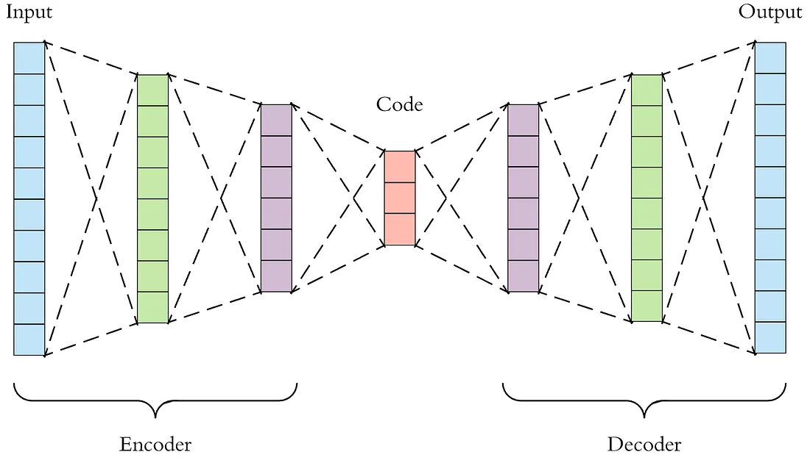
</p>

While simple AEs are excellent at lossy compression, they suffer from two drawbacks:

1. **Unstructured Latent Space**: The AE focuses solely on reconstruction, leaving the latent space $\mathbf{z}$ unregularized. This makes the AE unusable for generative tasks where we need to sample new, meaningful images.

2. **Oversmoothing of Detail:** Highly compressed AEs tend to over-smooth finer details. This is a common limitation of pixel-wise losses, which becomes apparent even when target metrics like SSIM are met the visual quality remains perceptually averaged, especially in complex datasets like medical images.

These limitations lead directly to the development of the VAE.

The **Variational Autoencoder (VAE)** was developed to solve AE's generative flaw. Instead of learning a deterministic mapping to a latent point $z$, the encoder maps $x$ to parameters $(\mu, \sigma)$ of a probability distribution $q(z|x)$. The latent vector $z$ is then sampled from this distribution.

The VAE objective introduces a strong regularization term via Kullback-Leibler (KL) divergence, resulting in the total loss: $L_{vae} = L_{rec} + \beta L_{kl}$. This $L_{kl}$ term forces the encoded distribution $q(z|x)$ to resemble a simple prior distribution (typically a standard Gaussian $p(z)$), meanwhile $L_{rec}$ keeps encouraging the model for better reconstructions.

However, VAEs' are similar to AEs in that they still have the limitation of blurry images due to the strong KL regularisation.

---


### Vector-Quantised VAE
Vector-Quantised VAEs (VQ-VAEs) addresses VAE's blurriness issue by introducing 
a discrete latent space, allowing for high-fidelity reconstruction while 
still providing a structured representation suitable for priors.

The general VQ-VAE structure maintains the Encoder and Decoder 
(typically deep convolutional neural networks) but replaces the VAE's continuous 
sampling step with a specialized Vector Quantizer (Codebook).

<p align="center">
 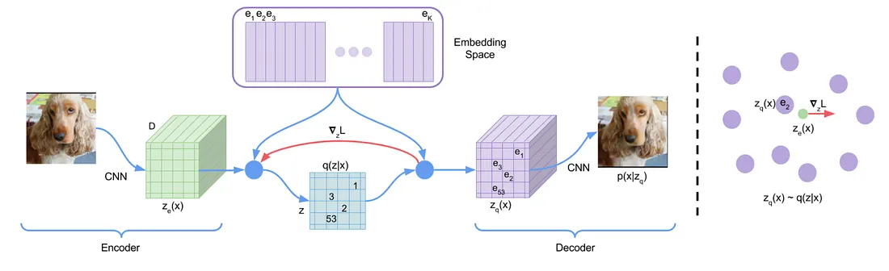
</p>

#### **Encoder**
The encoder is typically a convolutional neural network (CNN) that progressively 
downsamples the input image $x$. It is responsible for translating the pixels 
into a dense, continuous latent feature map.
This is the "pre-quantized" latent space. In our project, we explore variants 
ranging from simple convolutional stacks (the baseline) to deep residual stacks.

#### **Codebook and Quantization**
The **Vector Quantizer** converts the continuous representations from
the Encoder into a structured, **discrete** representation. It achieves
this using a **Codebook**, which is just a learnable dictionary (essentially a lookup table) of
$K$ fixed vectors (embeddings). 

1. **Input:** The Encoder provides the continuous latent feature map, $z$. 

2. **Vector Quantization (Lookup):** The quantizer iterates over every
vector within the codebook and finds the most similar / nearest embedding (e.g. using
L2 Norm). 

3. **Output:** The chosen nearest vector from the codebook is then passed to the decoder.

#### **Decoder**
The decoder is a mirrored CNN structure to the encoder, responsible for 
upsampling the quantized latent $\mathbf{z}$ back to the original pixel 
space $\hat{x}$. It typically uses transposed convolutions (deconv)
to increase the spatial resolution. 

#### **Learning Codebook**
Training the VQ-VAE is unique because the quantization step of 
picking the nearest vector is non-differentiable. 
To manage this, gradients from the Decoder are passed to 
the Encoder using a straight-through estimator (STE) during the backward 
pass. The training relies on three distinct loss components to optimize 
reconstruction, the codebook itself, and the encoder's outputs.

$$
\large
L = L_{\text{recon}} + \| \text{sg}[z_e] - e \|_2^2 + \beta \| z_e - \text{sg}[e] \|_2^2
$$

1.  **Reconstruction Loss ($L_{\text{recon}}$):** This is the standard 
distance metric (like Mean Squared Error or $\text{L}_1$) between the 
original image $x$ and the final reconstructed image $\hat{x}$. 
This drives the entire autoencoder structure to perform accurate 
reconstruction.

2. **Codebook alignment loss ($\text{sg}[z_e] - e \|_2^2$):** this term 
ensures the codebook embeddings $e$ are continuously updated to 
better represent the output of the encoder. It pulls the chosen 
codebook vector $e_k$ towards the encoder output $z_e$ that 
selected it.

3. **Commitment loss ($\beta \| z_e - \text{sg}[e] \|_2^2$):** Encourages 
the Encoder to commit its output to be close to the 
chosen quantized vector $e_k$. This prevents the encoder from 
drifting too far from the codes, ensuring that the nearest-neighbor 
lookup remains effective. The $\beta$ weight (typically $0.25 - 0.5$) 
controls the strength of this commitment.


## Dataset and Preprocessing
For this training, the **2D slice processed CISRO HipMRI** dataset was used. 
All images are in grayscale and have a resolution of **256 x 140** pixels,
however for this task we resize all images to **256 x 128** pixels and drop 
those that aren't originally in 256 x 140 form. The following are just a few samples from the dataset.

<p align="center">
 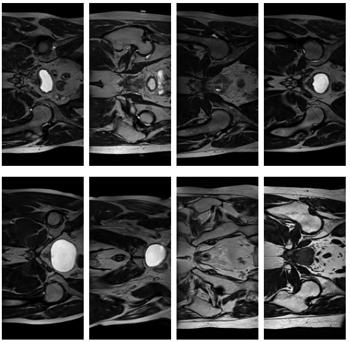
</p>

The dataset contains a total of **12,676 images** in total, with **11,460** 
images allocated for training, **672** for validation and **544** for testing. 

Currently, our preprocessing pipeline normalizes images to the range $[-1, 1]$. 
We provide the flexibility to switch to $[0, 1]$ normalization or implement 
more extensive transformations using ``torch.utils.Transforms``.

---

## Training Process

### First Attempt
The first attempt consisted of the simplest model possible,
representing a minimal VQ-VAE baseline with no architectural
'tricks'. This model uses just a convolutional encoder and a 
mirrored deconvolutional decoder.

<p align="center">
 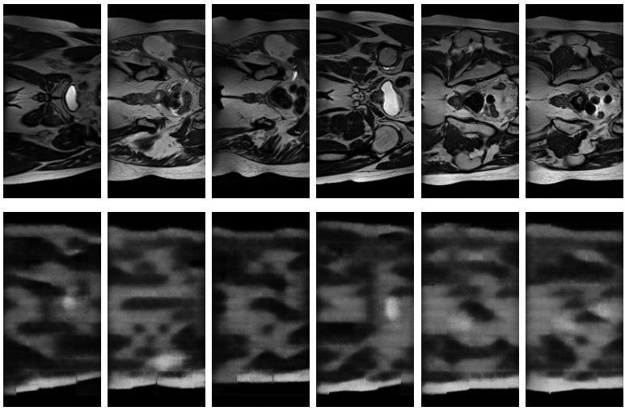
</p>

The images represent the original image in the first row and their respective
reconstructred images in the second row. As we can see the results 
aren't great. Blurry images (Avg SSIM < 0.4) and it's clear that the model is having 
trouble capturing the finer details.


### Adding Residuals
Following the baseline, the next phase involved adding Residual Blocks
to both the Encoder and Decoder. This is something that the original
authors did and we can expect that for medical imaging where finer details
are important, residual connections will be a critical source of performance
gain.

<p align="center">
 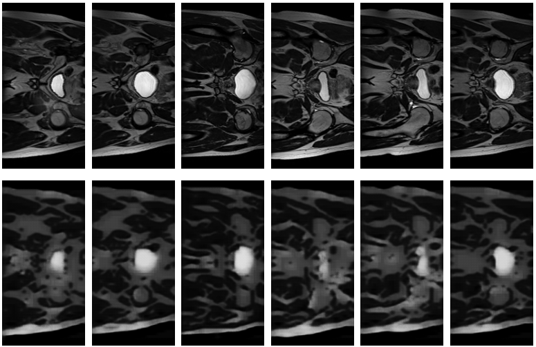
</p>

The above is the result of adding residual connections. Average SSIM score
of 0.62 on the test set was achieved. We can immediately see that the model
is much better at reconstructing the smaller details and the images are much
clearer compared to the baseline. 

### Finetuning and Final Results
The final phase focused on Hyperparameter Tuning of the VQ-VAE architecture to achieve the best results possible. Here we present all results. *All parameter tuning was done using the validation set*.

In the following we mention some interesting things we found during the
tuning stage:
* **Downsampling** is not always good! We found that the model for the 
hipmri dataset performed the best when downsampling to 32x16. Going further
(e.g. 16x8) resulted in blurry images meanwhile not downsampling enough
resulted in very slow convergence. This is likely because granular details needed in medical imaging such as MRIs are lost when downsampling too far leading to blurry images.

* **Large Embeddings** can worsen performances. This is likely due to
the fact that our data is small and using large embeddings would be overkill. Changing the original embedding 
dimension of 256 to 64 significantly improved SSIM scores in the later
stages of training (20 epochs+) and lead to overall better generalisation.

<br>
<p align="center">
 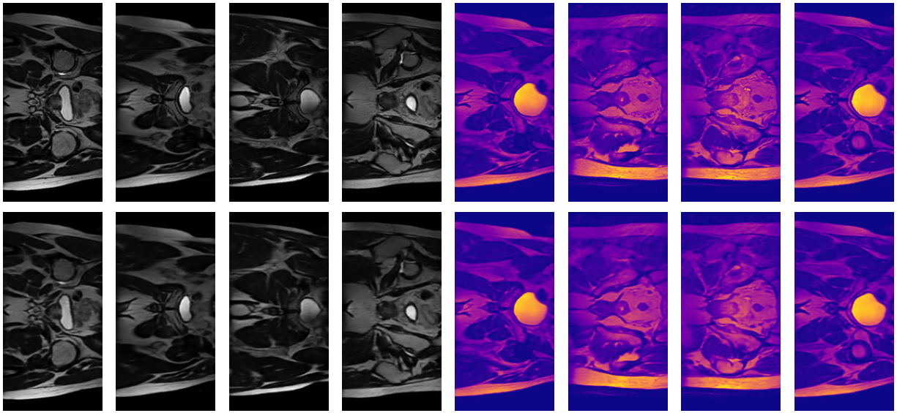
</p>

<p align="center">
 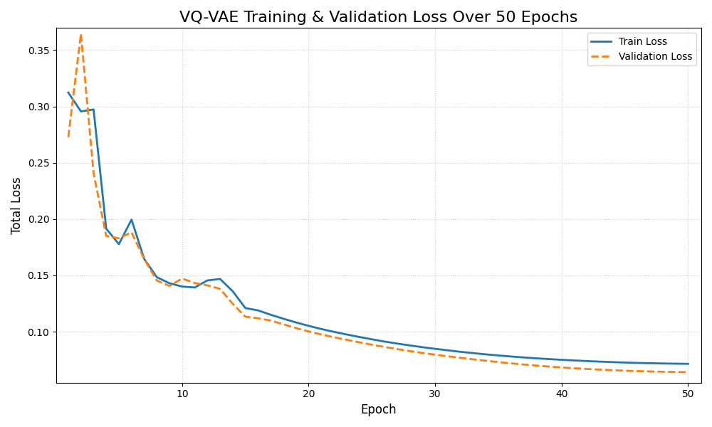
</p>

<div align="center">

| Type | SSIM Score | 
| :--- | :---: | 
| Minimum | 0.8986 | 
| Average | 0.9123 | 
| Maximum | 0.9232 | 

</div>

The above results demonstrates the full capability of the model to generate
clear images with an SSIM greater than 0.6 after a full training process of 50 epochs. The loss plot shows consistent decrease in both train and validation losses with no overfitting behaviours. Additionally, our final trained model achieves an average **SSIM score of 0.9123** on the **test set**, achieving well above the required 0.6 and therefore, we have completed the aim of this project. 

---

## Extra Analysis
This section includes an analysis of the model's internal representations.

### **Latent Index Map**

<div align="center">
  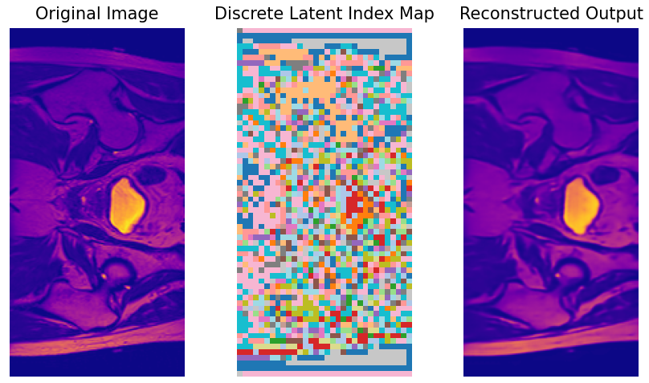
</div>

The middle panel (“**Discrete Latent Index Map**”) visualises the output of vector quantization. For each spatial location in the encoder’s latent grid, we select the **nearest code** from the learnable codebook and record its **index**. The figure then **upsamples** that index grid back to image size with **nearest-neighbor** interpolation and colors each index with a fixed categorical palette.

The index map looks good, the colors form coherent regions that align with anatomical boundaries while similar tissues appear as larger single-colour patches, indicating the encoder reliably assigns the same discrete token to the same local patterns.

### **Codebook Usage Visualisation**

The following are animated histograms of the VQ-VAE's codebook usage across 50 training epochs. The left represents the test split while the right shows training + evaluation splits where the x-axis is the code index and the y-axis is the assignment count. *Note this is our final model's which used 1024 embedding indicies*.

<div align="center">
    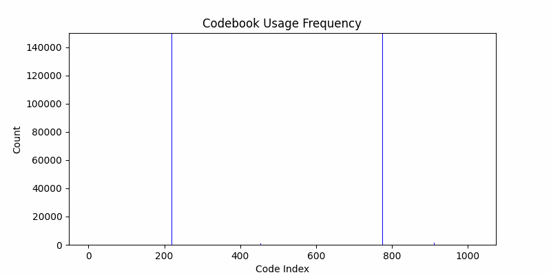
    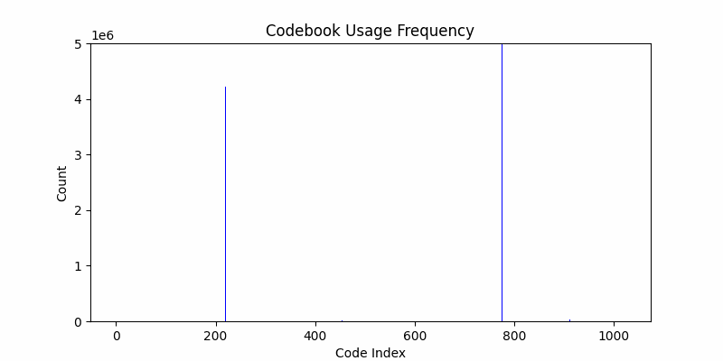
</div>

We can see some clear convergence. After heavy fluctuations at the start, the histogram shape stabiltises on both train and test sets with very similar distributions showing that the encoder and codebooks have settled into a consistent distribution that generalises well. However, we do see that many of the codebook indices are either 'dead' or rarely used, this does suggest that we could've used a smaller codebook to get similar results.

### **Codebook Visualisation**
The following is a t-SNE plot of the codebook where each dot corresponds to one embedding vector from the learnt codebook (1024 × 64 matrix). t-SNE projects the 64-dimensional vectors into 2D while trying to preserve their local similarity structure.
* Nearby dots: Embeddings that represent similar encoded features
* Far-apart dots: Embeddings encoding very different local image patterns

<br>
<div align="center">
  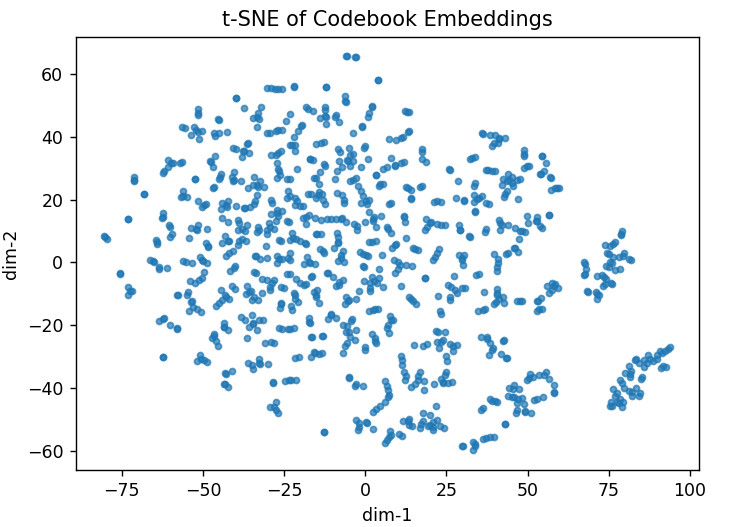
</div>
<br>
The t-SNE plot shows that our codebook has a broad, roughly circular central cluster structure with smaller, tighter sub-clusters, particularly toward the lower right. The dense regions will correspond to embeddings that are semantically similar and frequently inter-use, meanwhile the isolated clusters or sparse points likely correspond to the "dead" codewords. 

Together with our codebook usage histograms, this suggests that the quantizer has learned a well generalised representations but likely could've achieved similar results with a smaller codebook.

---

## Dependencies
This project runs Python 3.9+ with:

| Package | Version | 
| :--- | :--- |
| `torch` | `>= 2.4.*` | 
| `torchvision` | `==0.19.*` | 
| `torchmetrics` | `>=1.4` | 
| `numpy` | `>= 1.25.0` | 
| `Pillow` | `>= 10.0` | 
| `matplotlib` | `>= 3.8` |
| `tqdm` | `>= 4.66` |
| `nibabel` | `>= 5.2` |
|`scikit-learn` | `>= 1.7.1`|
---

## Usage

**Prepare the Dataset**  
   Place the `hipmri/` dataset in the same directory as the project scripts.

**Configure Settings**  
   Open `config.py` and update all necessary parameters (e.g., data paths, checkpoint directories, and training options).

**Train the Model**  
```bash
python train.py
```

**Evaluate or Visualize Results**

Before running evaluations, ensure that the checkpoint path is correctly specified in `config.py`.
Then, use the following command with the desired options:

```bash
python predict.py [--eval] [--codebook-usage] [--codebook-emb] [--loss] [--save] [--train]

--eval              Run model evaluation and plots original vs reconstruction

--codebook-usage    Visualize codebook usage frequencies using Histrogram

--codebook-emb      Plot t-SNE of codebook embeddings

--loss              Plot training and validation loss curves

--save              Save plots

--train             Uses train set instead of test set
```

---

## References
- van den Oord, A., Vinyals, O., & Kavukcuoglu, K. (2017). *Neural Discrete Representation Learning*.  
  *Advances in Neural Information Processing Systems (NeurIPS 2017).*  
  [https://arxiv.org/abs/1711.00937](https://arxiv.org/abs/1711.00937)

- explainingai-code. (2024). *VQVAE-PyTorch: `quantizer.py` implementation*. GitHub repository.  
  Available at: [https://github.com/explainingai-code/VQVAE-Pytorch/blob/main/model/quantizer.py](https://github.com/explainingai-code/VQVAE-Pytorch/blob/main/model/quantizer.py)

- CSIRO (2024). *Dataset csiro:51392v2*. CSIRO Data Access Portal.  
  Available at: [https://data.csiro.au/collection/csiro:51392v2?redirected=true](https://data.csiro.au/collection/csiro:51392v2?redirected=true)

- Dertat, A. (2017). Applied Deep Learning – Part 3: Autoencoders. Medium (TDS Archive). Available at: https://medium.com/data-science/applied-deep-learning-part-3-autoencoders-1c083af4d798

- Li, Y. (2022). Deep Image Synthesis through VQVAE and VQGAN. Medium. Available at: https://medium.com/@yl4886/deep-image-synthesis-through-vqvae-and-vqgan-e90fe9a27812

---